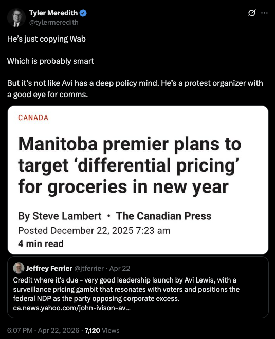
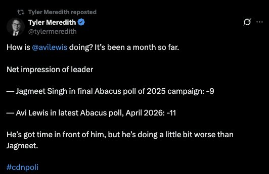

Tyler Meredith would like you to believe he is a policy mind. He has the resume for it — IRPP, six federal budgets, two Liberal platforms, the Munk School fellowship, the Maytree affiliation, the Hill Times ranking him the second most influential staffer in Ottawa. He has spent the better part of two years building a firm — Meredith Boessenkool & Phillips — on the premise that he is a non-partisan technician of the public interest, a man who, as the firm's tagline insists, just wants to "make policy better."

Take him at his word for a moment, because the word does not survive contact with the evidence.

When Avi Lewis launched his federal NDP leadership with a surveillance-pricing platform that drew praise even from people outside the party's orbit, Meredith's contribution to public discourse was [a sneer](https://xcancel.com/tylermeredith/status/2047120140983021854): Avi is "just copying Wab," he has no "deep policy mind," he is "a protest organizer with a good eye for comms." This is not policy analysis. It is not even a serious political critique. It is the reflexive condescension of a particular Ottawa class toward anyone who arrived at power without first apprenticing in a minister's office. It is the sound of a man whose entire professional self-image depends on the proposition that real politics happens in the rooms he has been in, and the people in those rooms are the ones qualified to speak.

"…it is difficult to get a man to understand something, when his salary depends upon his not understanding it."

— Upton Sinclair

Sinclair's line is the relevant one: it is difficult to get a man to understand something, when his salary depends upon his not understanding it. Meredith's salary — quite literally, through MBP Intelligence, the subscription product where he sells weekly "Carneynomics" analysis to corporate decision-makers — depends on the federal political spectrum continuing to look the way it looked when he was writing budgets. A Liberal centre that is the only serious game in town. A Conservative opposition that frightens his clients into buying access. An NDP that can be safely dismissed as the home of vibes and protest signs, useful for keeping the Liberals honest but not for anything as adult as governing. That is the market he sells into. A federal NDP led by an eco-socialist who can land a launch, name a corporate enemy, and pull oxygen from the Liberal left flank is not a debate Meredith wants to have on the merits. It is a threat to the product.

So the dismissal arrives pre-packaged. Avi is reduced to a comms guy. The actual surveillance-pricing proposal goes unengaged. The man who claims a deep policy mind engages none of the actual policy. He does vibes. He does class signaling. He does the Ottawa staffer's eternal move of confusing his own credentials for the standard against which all politics must be measured.

A month into Lewis's leadership, after previous party leadership ran the NDP into the ground, Meredith is [back at it](https://xcancel.com/tylermeredith/status/2048503452490170526): an Abacus comparison, Avi's net impression at -11 against Jagmeet's -9 at campaign end, framed as mild disappointment. "He's doing a little bit worse than Jagmeet." Then he retweeted himself, to make sure it landed. The man who cannot engage Lewis's ideas is tracking his standings to the decimal point.

The disingenuousness is worth naming. Meredith presents himself as a multi-partisan technician — Liberals and Conservatives and [Shannon Phillips](https://www.cbc.ca/news/politics/avi-lewis-leap-manifesto-shannon-phillips-9.7131960) all under one roof, just making policy better — but his actual political project is narrower and more familiar. Phillips is the former Alberta NDP environment minister who [ran surrogate attacks on Lewis](https://www.reddit.com/r/ndp/comments/1ruy2l8/the_actual_video_shannon_phillips_you_should_be/) through the leadership race. From the same desk. It is the defence of a specific consensus: fiscally orthodox, financial-sector-friendly, climate-as-tax-design rather than climate-as-political-economy, the consensus he helped build inside the Trudeau-Freeland-Morneau finance offices and that he now monetizes from outside. The multi-partisanship is real in the sense that Boessenkool and Phillips are not decorative hires. It is also a feature, not a bug, for clients who want coverage regardless of who wins, so long as whoever wins stays inside the consensus.

The eco-socialist left is outside that consensus. That is the entire point of it. And Meredith — who is genuinely smart, genuinely well-read, genuinely capable of engaging Avi's actual ideas if he chose to — chooses instead to call him a protest organizer. Not because he believes it. Because the people paying for MBP Intelligence need to believe it.

There is a version of Meredith who would be worth arguing with. A Liberal who said plainly: I think carbon pricing plus industrial policy plus a strong financial sector is the better path, here is why I think Lewis's program would fail on its own terms, here is the trade-off I am willing to defend. That would be a debate. The version we get is the version that calls the other side unserious and bills the corporate sector for the privilege. The conclusion and the invoice arrive together.

Sinclair was writing about California land speculators, not Ottawa policy consultants, but the mechanism travels. A man whose income depends on the Liberal centre being the only serious place to stand will not, on his own, come to understand that it is not. He will instead spend his evenings on social media explaining that the people who have noticed are protest organizers with a good eye for comms.

Both things are true. Avi Lewis does have a good eye for comms. And Tyler Meredith has a salary that depends on him not understanding why the comms are working.
